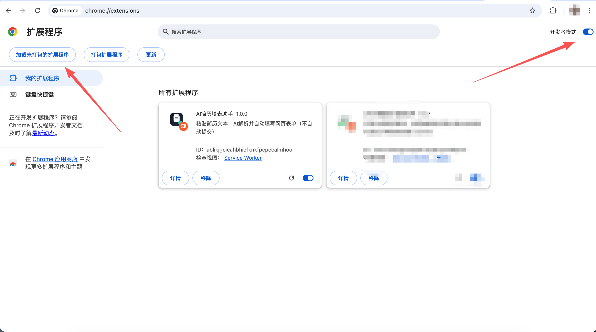
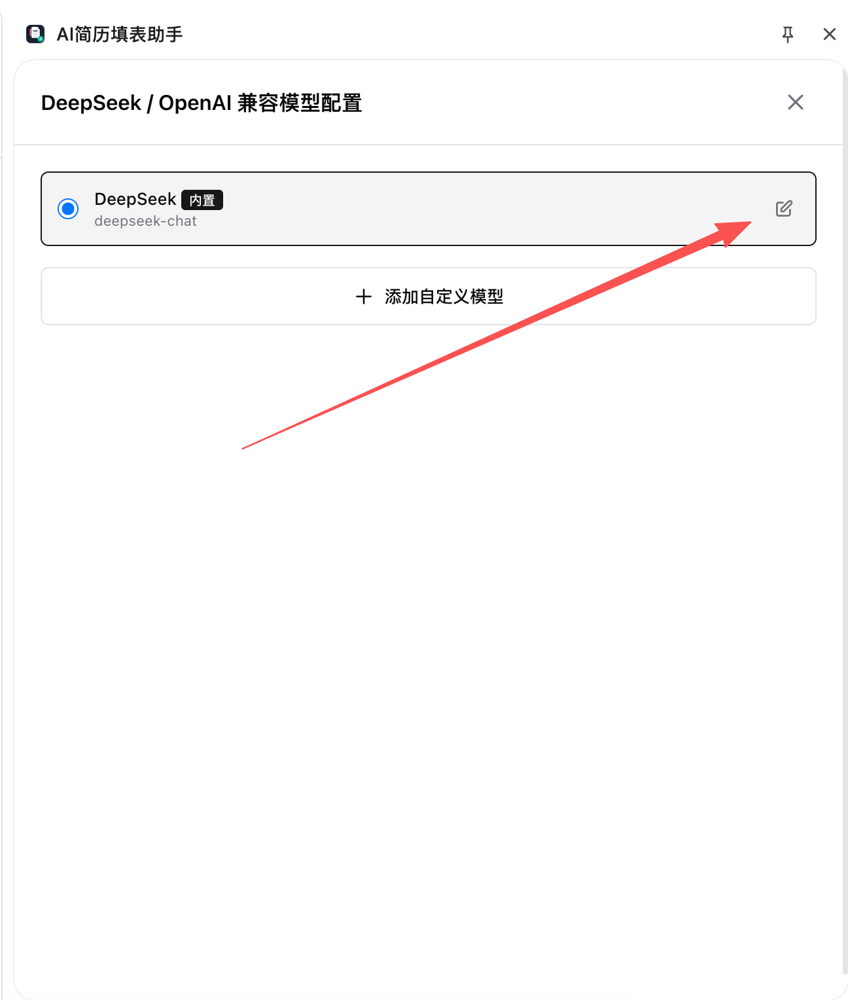
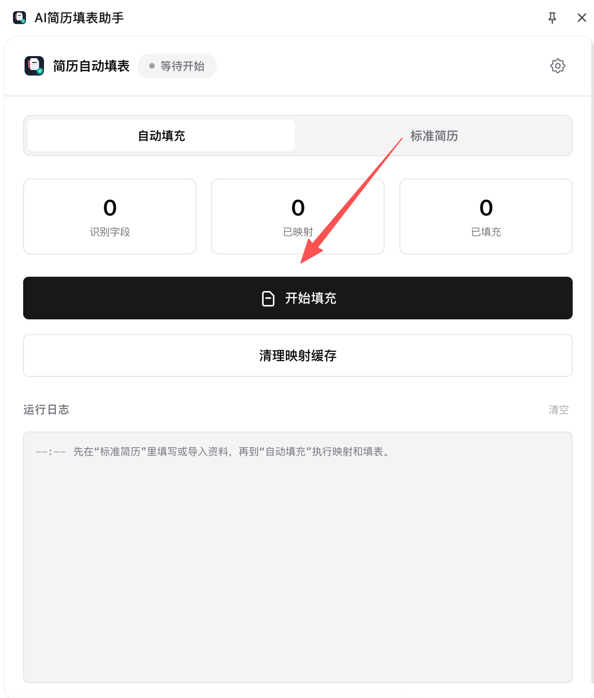

# AI 简历填表助手

一个基于 Chrome/Edge Side Panel 的浏览器扩展。

本仓库基于 [1lck/AI-Resume-Form-Filling-Assistant](https://github.com/1lck/AI-Resume-Form-Filling-Assistant) 按照 GPL-3.0 许可进行修改和维护。当前版本增加了独立竞赛获奖资料、重复经历自动扩展、中文校园招聘字段规则、Moka 等自定义控件适配、资料迁移和诊断能力。详细来源和修改说明见 [NOTICE.md](NOTICE.md)。

## 🚀 相比上游版本的主要改进

这个仓库不是简单换壳，而是针对中文校园招聘表单中实际遇到的重复经历、固定选项和自定义控件问题进行了持续改进。

| 能力 | 上游基础能力 | 当前增强版本 |
| --- | --- | --- |
| 竞赛获奖资料 | 获奖内容容易与校园经历混在一起 | 新增独立竞赛获奖结构，分别保存时间、名称、等级、名次、颁发机构和描述 |
| 多条经历填写 | 页面只有一张卡片时通常需要手动新增 | 根据简历记录数量，对教育、实习、工作、项目和获奖等重复区块进行受控扩展 |
| 重复记录对应 | 多张相似卡片可能重复使用第 1 条资料 | 根据区块类型和卡片顺序计算记录索引，降低重复填写和错位填写 |
| 中文校招字段 | 主要依赖模型临时判断 | 对民族、籍贯、政治面貌、培养方式、学历类型、最高学历、成绩排名等常见字段增加本地确定性规则 |
| 自定义下拉框 | 原生 `select` 支持较好，自定义控件不稳定 | 增加对 Moka 等自定义下拉菜单、真实选项节点和确认事件的适配 |
| 日期控件 | 非原生日期组件容易只打开面板而不生效 | 增加年月拆分、只读输入框和部分日期面板的运行时适配 |
| 资料保存与升级 | 扩展目录变化后可能出现资料隔离 | 增加标准简历导入导出、旧数据迁移和本地存储恢复路径 |
| 问题排查 | 失败原因不容易定位 | 增加映射诊断、运行日志、隐私脱敏和自动化测试 |

### 这些改进主要解决什么

- **奖项不再挤在校园经历里**：竞赛获奖成为独立数据模块，每个奖项单独对应网页中的一条获奖记录。
- **页面卡片不够时自动补齐**：在能够识别区块语义和新增入口时，按资料数量补足重复卡片，再逐条填写。
- **相同内容不再反复填入多张卡片**：扫描结果会结合教育、实习、项目、工作和获奖等区块类型计算重复索引。
- **固定选项优先走本地规则**：对于“统招全日制”“是否最高学历”“前 20%”等稳定值，尽量避免每次依赖模型猜测。
- **下拉框不只停留在展开状态**：针对自定义菜单，查找实际承载点击事件的选项节点，并在选择后检查控件显示值。
- **升级时尽量保留原有资料**：标准简历和模型配置保存在扩展本地存储中，同时提供导入导出和旧数据迁移能力。

版本变化见 [CHANGELOG.md](CHANGELOG.md)。

你维护一份标准化简历，扩展负责在网页里扫描表单字段，用大模型只做“字段映射”，再由本地脚本执行确定性填充。默认不会自动提交表单。

<p align="center">
  
</p>

<p align="center">
  
  
  
  
  
</p>

<p align="center">
  
  
</p>

<p align="center">
  
  
</p>

> [!TIP]
> 适合需要频繁填写网申、招聘官网和报名表单的人。扩展默认只填值，不提交表单。

## 🎯 这项目解决什么问题

大多数网申/招聘表单都有几个共同问题：

- 同一份信息要反复填写
- 不同网站字段命名不统一
- 某些页面用了自定义控件、日期面板、单选/多选组，脚本很难稳定处理
- 纯“让 AI 直接操作页面”不够可控，也不方便排查失败原因

这个项目的做法不是让 AI 直接乱填页面，而是拆成两步：

1. 先把你的简历整理成固定 schema
2. 再让 AI 只判断“页面字段应该对应简历里的哪个路径”

映射完成后，真正的写值、触发事件、匹配选项、处理日期控件，都在内容脚本里本地执行。

这让行为更可控，也更容易调试。

## ✨ 核心能力

- 标准简历 schema：内置较完整的简历结构，覆盖基本信息、求职偏好、教育经历、实习、工作、项目、校园经历、证书、语言、补充信息等
- 独立竞赛获奖模块：奖项名称、时间、等级、名次、颁发机构和获奖描述分别保存，避免整段奖项文本被重复填入
- 重复经历受控扩展：在识别到明确区块和新增入口时，按简历条目数量补充教育、实习、工作、项目和获奖卡片
- AI 导入简历：支持粘贴原始简历文本，或者上传带文字层的 PDF，自动抽取并整理为标准简历 JSON
- 三种填充模式：
  - 整页填充：覆盖当前页面可识别字段
  - 增量填入：跳过已经有值的字段
  - 选区填入：先框选页面区域，只填选区内字段
- 多控件支持：`input`、`textarea`、`select`、`radio group`、`checkbox group`、`contenteditable`
- 日期控件适配：对部分只读日期输入框和日期面板做了特殊处理
- 深度扫描：填充前自动展开明确标记为“展开/查看更多”的折叠区块，再扫描新增字段
- 字段映射缓存：同一页面结构会复用本地映射缓存，减少重复调用模型
- 运行诊断日志：侧边栏展示关键日志，支持把完整会话自动导出到 `debug-logs/`
- 独立简历配置页：复杂简历字段不挤在侧边栏里，支持打开宽页面编辑
- 多模型配置：内置 DeepSeek，也可以配置任意 OpenAI 兼容接口

## 🧩 适合什么场景

- 校招/社招网申表单
- 企业招聘官网
- 需要频繁重复填写的申请表
- 希望保留人工确认，不想自动提交的人

## 🚫 不做什么

- 不自动提交表单
- 不处理 `input[type="file"]` 的自动上传
- 不内置 OCR，扫描版 PDF 需要你先 OCR
- 不依赖后端服务，不上传到你自己的服务器

## ⚙️ 项目怎么工作

### 1. 标准简历

扩展先维护一份固定 schema 的简历数据，模型配置和 API Key 都存储在当前设备的 `chrome.storage.local` 中，不会通过 Chrome Sync 跨设备同步。

简历原文和结构化简历可能超过 Chrome Sync 的单项配额，因此不会参与跨设备同步。升级到本版本时，扩展会自动把旧版同步存储里的简历数据和模型配置迁移到本地存储，并清理旧键。

这一步的价值是把“原始简历文本”变成“可复用字段目录”，后面的映射和填充都围绕它进行。

### 2. 页面字段扫描

内容脚本会扫描当前页面可填写控件，并尽量提取：

- 字段标签
- placeholder
- 选项列表
- 上下文文本
- 附近标签
- 所在区块语义

项目里专门写了字段标签提取、区块语义判断、日期运行时判断等辅助模块，不是单纯只看 `label`。

### 3. AI 只做字段映射

发送给模型的是：

- 当前页面字段列表
- 已填写的标准简历字段目录
- 允许的 transform 规则

模型只返回“某个页面字段对应哪个 `resumePath`”，例如：

- `personal.email`
- `educations.0.school`
- `internships.0.company`

而不是直接返回一整页最终表单值。

### 4. 深度扫描与重复经历扩展分开执行

整页填充前，深度扫描只负责识别带有“展开”“查看更多”或明确折叠状态的控件，等待新增字段渲染后再扫描。

教育、实习、工作、项目和获奖等重复经历使用另一套受控扩展逻辑：只有在识别出明确的经历区块、可用的新增入口，并确认标准简历中还有对应记录时，才会按需新增卡片。普通页面中的未知“添加”“新增”“新建”按钮不会被深度扫描随意点击；选区填入也不会触发整页深度扫描。

### 5. 本地确定性填充

拿到映射后，扩展会在浏览器里本地完成：

- 取值
- 日期/手机号拆分
- 单选/多选匹配
- 下拉选择
- 输入事件与 change 事件触发

这一步不依赖模型，行为更稳定。

## 🚀 快速开始

### 1. 安装扩展

1. 打开 `chrome://extensions/` 或 `edge://extensions/`
2. 开启“开发者模式”
3. 点击“加载已解压的扩展程序”
4. 选择当前项目目录
5. 点击扩展图标，打开侧边栏

这个项目没有构建步骤，源码目录可以直接加载。

### 2. 配置模型

侧边栏右上角进入设置。

模型配置只保存在当前浏览器的本地扩展存储中，API Key 不会通过消息传给页面脚本；后台会根据模型 ID 读取配置并代理请求。

默认内置一套 DeepSeek 配置模板，你也可以改成任意 OpenAI 兼容接口。当前实现调用的是：

- `POST /chat/completions`

常见示例：

- `Base URL`: `https://api.deepseek.com/v1`
- `Model`: `deepseek-chat`
- `API Key`: 你自己的 key

### 3. 准备标准简历

有两种方式：

- 手动填写标准简历
- 粘贴原始简历文本，或上传带文字层的 PDF，让 AI 先导入

如果简历内容较多，推荐点击“打开简历配置页”在独立页面里维护。

### 4. 在网页里执行填充

打开目标表单页后，可在侧边栏选择：

- `开始填充`
- `增量填入`
- `选区填入`

扩展声明 HTTP/HTTPS 页面访问权限，以便侧边栏在切换任意普通网页标签页后仍能读取并填写当前页面。页面脚本不会常驻网站，只会在你点击填充操作后通过 `scripting` 权限动态注入当前页面。发给模型的页面 URL 会自动移除 query/hash，避免把临时参数和 token 带出。

填充完成后，请自己检查并手动提交。

## 🧠 当前实现里值得注意的设计点

### 1. 映射缓存是按“页面结构签名”做的

项目不是简单按 URL 缓存，而是会结合字段种类、标签、placeholder、section 信息等生成签名。

这能避免“同一页面字段已经变了，但还错误复用旧缓存”的问题。

### 2. 侧边栏日志和完整诊断日志分层显示

UI 里只显示关键过程日志，冗长的结构化诊断不会全部堆到面板里。

如果你授权项目目录，完整会话日志会自动导出到：

- `debug-logs/`

适合排查“为什么这个网站没映射上”或“为什么这个日期控件没填进去”。

### 3. 项目偏向校招/中文网申语义

schema 和映射提示词里，对这些内容做了额外强化：

- 教育经历
- 实习经历
- 校园经历
- 学历类型 / 培养方式 / 实验室 / 导师 / 学号等字段

如果你的主要场景是中文招聘站，这一套会比通用型 schema 更顺手。

## 🧭 适配与验证状态

| 场景 | 当前状态 | 说明 |
| --- | --- | --- |
| 原生输入框、文本域、单选和复选 | 自动化测试覆盖 | 支持常规取值、写值和事件触发 |
| 原生下拉框 | 自动化测试覆盖 | 支持按值和显示文本匹配 |
| 教育、实习、工作、项目、获奖重复记录 | 逻辑与回归测试覆盖 | 支持识别重复区块、扩展卡片和按顺序映射；具体站点仍取决于页面结构 |
| Moka 学校、专业等自定义下拉框 | 已做真实页面针对性适配 | 已验证真实菜单节点点击与选项显示，但不代表所有 Moka 页面字段都已覆盖 |
| Moka 年月日期控件 | 已做真实页面针对性适配 | 已验证部分教育和经历年月控件；不同企业配置仍可能需要新增适配 |
| 其他招聘系统的自定义控件 | 通用规则加按站点扩展 | 可以先用诊断日志确认结构，再补充确定性适配 |

> 自动化测试通过只证明对应模块和回归用例正常，不等同于所有招聘网站的整页填写均已验证。插件默认保留人工检查和手动提交步骤。

## 📌 支持与限制

### 已支持

- 文本输入框
- 文本域
- 下拉框
- 单选组
- 多选组
- `contenteditable`
- 部分只读日期输入框与日期面板
- 整页/增量/选区三种填充模式

### 明确限制

- 文件上传字段不能自动写入
- 扫描版 PDF 没有文字层时无法直接导入
- 跨域 `iframe` 内的字段可能无法识别或填写
- 极端自定义控件仍可能需要单站点适配
- 深度扫描依赖按钮的可访问性属性、折叠状态或明确文本；站点完全没有这些语义时仍需要手动展开
- 刚重载扩展后，旧页面里可能还挂着旧版 content script；刷新页面一次再试最稳妥

## ✅ 测试

仓库里已经带了一组基于 Node 内置测试运行器的测试，覆盖了这些核心部分：

- schema 结构与归一化
- AI JSON 解析容错
- 字段标签提取
- 页面字段 payload 构造
- 填充模式辅助逻辑
- 诊断日志格式
- 映射缓存版本与签名规则
- 模型配置迁移、HTTPS 地址校验、敏感值脱敏

运行：

```bash
npm test
```

CI 会同时运行全部 Node 测试、JavaScript 语法检查和扩展 JSON 配置校验。

开发过程中可以在本地生成联调用表单：

- `output/playwright/test-form.html`

它主要用于验证增量填入和选区填入这两条链路，属于本地测试产物，不随源码仓库发布。

## 🗂️ 项目结构

```text
.
├── manifest.json               # Chrome MV3 配置
├── background.js               # 统一代理 OpenAI 兼容接口调用
├── popup.html / popup.js       # 侧边栏 UI、模型设置、填充入口、日志
├── resume-editor.html / .js    # 独立简历配置页
├── content.js                  # 页面扫描、字段映射、实际填充
├── package.json                 # 本地测试命令
├── CHANGELOG.md                 # 当前增强版本的主要变化
├── .github/workflows/test.yml   # Node 测试、语法和配置校验
├── shared/
│   ├── resume-schema.js        # 标准简历 schema
│   ├── resume-storage.js       # 简历本地存储与旧版同步数据迁移
│   ├── model-storage.js        # 模型配置本地存储与旧版同步配置迁移
│   ├── ai-client.js            # 页面侧统一 AI 消息调用
│   ├── resume-prompts.js       # 简历导入提示词
│   ├── diagnostics.js          # 结构化诊断日志格式化
│   ├── field-text.js           # 字段标签抽取与评分
│   ├── field-semantics.js      # 区块语义判断
│   ├── fill-runtime.js         # 填充值与日期运行时适配
│   ├── log-export.js           # 调试日志导出
│   └── content-bridge.js       # content script 版本/能力握手
├── libs/pdfjs/                 # PDF 文本提取
└── tests/                      # Node 测试
```

## 🧪 关于模板模块

仓库里还保留了一组问卷/考试站点模板相关模块：

- `modules/scanner-enhanced.js`
- `modules/site-matcher.js`
- `modules/template-manager.js`
- `templates/wjx.json`
- `templates/tencent.json`

它们更像一条早期或实验性质的能力线，用于问卷星、腾讯问卷这类站点的题目模板扫描；不是当前“标准简历自动填表”主流程的核心依赖。

## 🔒 隐私与安全

请默认按“简历数据是敏感信息”来理解这个项目。

- 你的 `API Key`、模型配置、标准简历会保存在当前浏览器的本地扩展存储里，不参与 Chrome Sync
- 用于字段映射和简历导入的内容会发送到你配置的模型接口
- API Base URL 默认必须使用 HTTPS；仅允许 `localhost`、`127.0.0.1`、`::1` 的本机 HTTP 调试地址
- 诊断日志会对常见个人信息脱敏，导出目录最多保留 50 个 JSON 日志文件
- 发送内容可能包含：简历文本、页面 URL、页面标题、字段标签、选项和上下文文本
- 项目默认不会自动提交表单

如果你不希望任何简历内容离开本地，就不要配置在线模型接口。

## 🛠️ 适合怎么继续演进

如果你准备把这个项目继续开源维护，后续最值得做的方向大概是：

- 增加更多招聘站点和控件适配样例
- 补一套可复现的端到端联调脚本
- 把模板模块和主流程的关系进一步梳理清楚
- 增加英文 README 或双语文档

## 🤝 贡献

欢迎提 Issue 和 PR。

如果你要反馈某个站点无法填写，最好同时提供：

- 目标站点页面类型
- 失败字段示例
- 侧边栏关键日志
- `debug-logs/` 导出的诊断文件

这样更容易定位问题。

## 📄 License

[GPL-3.0](LICENSE)

本项目是上游项目的 GPL-3.0 衍生版本。来源、维护者和主要修改范围见 [NOTICE.md](NOTICE.md)，版本演进见 [CHANGELOG.md](CHANGELOG.md)。
